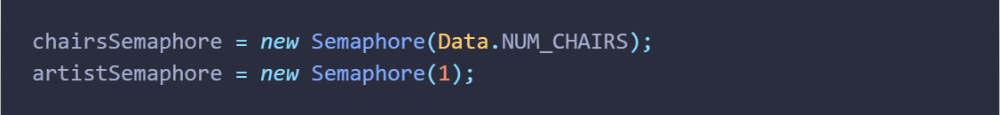
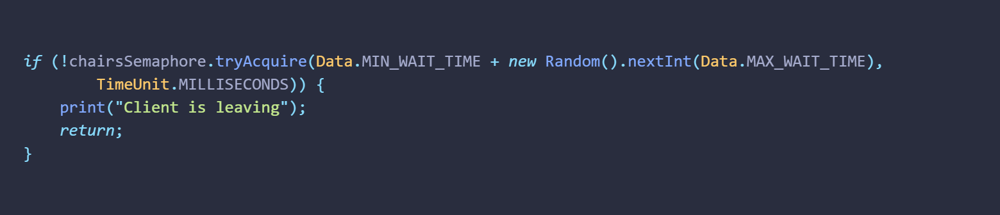
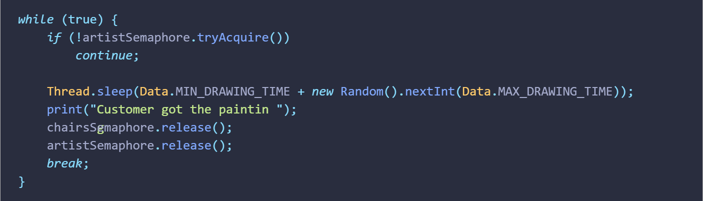

# ***Simulazione Artistra di Strada e Clienti***
### *Michelon Eric - 4BIA*
---

## [Semafori](src/michelon/Main.java)
Sono stati importati i semafori dalla libreria java.util.concurrent.Semaphore

Sono stati utilizzati due semafori
1. **chairsSemaphore**: per gestire le sedie libere ed occupate
2. **artistSemaphore**: per gestire il cliente che sta occupando l'artista per avere un ritratto 

---

## [Cliente](src/michelon/Customer.java)
Il metodo Customer.run può essere suddiviso in due parti
1. *Ottenimento di una sedia*

- **[*if (!chairsSemaphore.tryAcquire(...), ...)*]:** il cliente cerca di ottenere una sedia per un determinato tempo se fallisce, si allontana
2. *Ottenimento del ritratto*

- **[*if (!artistSemaphore.tryAcquire()) continue*]:** se l'artista non è disponibile, aspetta 
- **[*Thread.sleep(...)*]:** ottenimento del ritratto simulata con un'attesa di tempo randomico
- **[*chairsSemaphore.release()*]:** il cliente si alza e libera una sedia 
- **[*artistSemaphore.release()*]:** l'artista ha completato il ritratto e può farne un'altro

